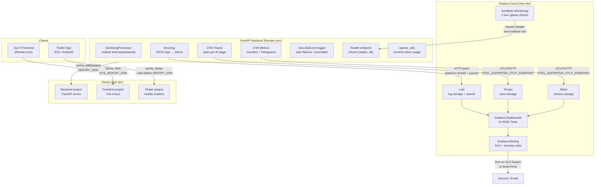

# Observability Stack — ai-wod-timer

Full production observability for a Render.com-hosted FastAPI backend, Vue 3 frontend, and Flutter mobile app.

## Architecture



## Why Each Decision Was Made

### Render.com PaaS — push-based signals only
Render has no persistent filesystem and no way to run a Prometheus scraper sidecar. Every signal must be **pushed out** from the app:
- Logs: HTTP push to Loki (not stdout-scraping)
- Metrics: OTLP/HTTP to Grafana Cloud Mimir (not Prometheus pull)
- Traces: OTLP/HTTP to Grafana Cloud Tempo (not gRPC — gRPC blocks at startup)

### structlog over Python `logging`
Structured JSON from day one. Every log line is machine-readable and directly queryable in Loki with LogQL. `SanitizingProcessor` runs in the processor chain to redact sensitive fields before any emission.

### Grafana Cloud over self-hosted
No VPS, no Docker Compose, no ops burden. Free tier covers:
- Loki: 50 GB/month logs
- Mimir: metrics retention
- Tempo: traces
- Synthetic Monitoring: 1-min check interval
- Alerting: routed to Discord/email

### Sentry for errors (not Grafana)
Sentry gives stack traces, release tracking, and breadcrumbs that Grafana does not. Native SDKs for FastAPI, Vue, and Flutter. Free tier: 5k errors/month permanent.

### OTel HTTP exporter over gRPC
The gRPC exporter establishes a persistent TCP connection at startup. On Render, this caused the health check to time out (30+ min wait) because the app appeared unresponsive. The HTTP exporter is non-blocking.

### Python 3.12 pinned via `.python-version`
SQLAlchemy 2.0.25 has an `AssertionError` in `TypingOnly` on Python 3.14 (Render's default). Pinning to 3.12.3 prevents the build from using an incompatible runtime.

### `configure_metrics()` called before `metrics.py` import
OTel meters bind to whichever `MeterProvider` is active at import time. `configure_metrics()` must set the provider in `main.py` before the metrics module is imported, or all metrics are bound to the no-op default provider.

### Loki shipper: daemon thread + queue
Log shipping must never block the request path. A background daemon thread drains an in-memory queue (max 2000 entries) and batches up to 200 entries per POST. Failures are silently dropped.

### Flutter: `appRunner` pattern for Sentry
`SentryFlutter.init()` must receive an `appRunner` callback to wrap `runApp()`. This is the only way to catch:
1. Dart errors in the Flutter framework
2. Native crashes (iOS/Android)
3. Background isolate errors

---

## File Map

```
backend/
  app/
    observability/
      logging.py        # structlog setup + Loki HTTP shipper
      metrics.py        # OTel counters + histograms (AI pipeline, HTTP, security)
      tracing.py        # OTel TracerProvider + FastAPI/HTTPX auto-instrumentation
      security.py       # log_security_event() for auth failures
      sanitize.py       # SanitizingProcessor — redacts password/token fields
      health.py         # GET /health → {status, db}
      openai_utils.py   # record_openai_usage() + record_agents_usage()
  .python-version       # pins Python 3.12.3 (SQLAlchemy compat)

frontend/
  src/
    observability/
      index.ts          # Sentry Vue SDK init

flutter/
  lib/
    observability/
      observability.dart  # SentryFlutter.init with appRunner pattern

observability/
  README.md                              # this file
  SETUP_CHECKLIST.md                     # step-by-step connection guide
  synthetic_monitoring.yaml              # Grafana Cloud uptime check config
  provisioning/
    dashboards/
      dashboard.yaml                     # Grafana provisioning config
      ai_wod_timer.json                  # dashboard panels (AI pipeline RED metrics)
    alerting/
      slo.yaml                           # SLO breach alert rules
      security.yaml                      # BruteForceDetected alert rule
```

---

## Environment Variables

All credentials live in `backend/.env` (local) and Render's Environment dashboard (production). Never hardcoded.

| Variable | Used by | Purpose |
|---|---|---|
| `SENTRY_DSN` | backend | FastAPI error reporting |
| `VITE_SENTRY_DSN` | frontend build | Vue error reporting |
| `GRAFANA_CLOUD_LOKI_URL` | logging.py | Loki push endpoint base URL |
| `GRAFANA_CLOUD_LOKI_USER` | logging.py | Loki instance ID (basic auth username) |
| `GRAFANA_CLOUD_LOKI_API_KEY` | logging.py | `glc_` access policy token |
| `OTEL_EXPORTER_OTLP_ENDPOINT` | tracing.py | Grafana Cloud OTLP gateway URL |
| `OTEL_EXPORTER_OTLP_HEADERS` | tracing.py | `Authorization=Basic base64(instanceID:glc_token)` |
| `ENV` | logging.py, Sentry | `development` / `production` label |

### OTLP Headers format
```bash
# instance ID comes from Grafana Cloud stack → OpenTelemetry section
echo -n "INSTANCE_ID:glc_YOUR_ACCESS_POLICY_TOKEN" | base64
# Set: OTEL_EXPORTER_OTLP_HEADERS=Authorization=Basic <output>
```

---

## Key Metrics Tracked

| Metric | Type | Labels | Why |
|---|---|---|---|
| `ai_parse_requests_total` | Counter | workout_type, model | Parse volume by type |
| `ai_parse_duration_seconds` | Histogram | workout_type, stage | Latency for classify + parse stages |
| `ai_tokens_used_total` | Counter | model, direction | OpenAI cost tracking |
| `ai_classifier_confidence` | Histogram | workout_type | Local regex classifier effectiveness |
| `ai_parse_errors_total` | Counter | workout_type, error_type | Error rate |
| `workouts_parsed_total` | Counter | workout_type | Business success metric |
| `http_requests_total` | Counter | method, endpoint, status | HTTP RED metrics |
| `security_auth_failures_total` | Counter | ip | Brute-force detection |

---

## Alerts

| Alert | Condition | Severity | Runbook |
|---|---|---|---|
| `ParseErrorRateHigh` | >10% errors in 5 min | warning | Check Loki for AI errors |
| `ParseLatencyHigh` | p95 > 8s for 5 min | warning | Check Tempo for slow spans |
| `BruteForceDetected` | >10 auth failures/min | critical | Block IP at load balancer |

---

## Uptime Monitoring

Two Grafana Cloud Synthetic Monitoring checks (1-min interval):
- `https://ai-wod-timer.onrender.com/health` — asserts `status` keyword in response
- Frontend root URL — HTTP 200 check

Config: `observability/synthetic_monitoring.yaml`

---

## Dashboard-as-Code

`observability/provisioning/dashboards/ai_wod_timer.json` is the **single source of truth** for the Grafana dashboard. Two GitHub Actions workflows keep the repo and Grafana Cloud in sync.

### Workflows

| Workflow | Trigger | What it does |
|---|---|---|
| `sync-grafana-dashboard.yml` | Manual (`workflow_dispatch`) | Pushes repo JSON → Grafana Cloud |
| `export-grafana-dashboard.yml` | Manual | Pulls live Grafana JSON → opens a PR |

The sync workflow's automatic push trigger is currently disabled. To enable it, add a `push` event scoped to the dashboard file path (see `.github/workflows/README.md`).

### Required secrets

Both workflows require two GitHub repository secrets:

| Secret | Value |
|---|---|
| `GRAFANA_URL` | `https://aiwodtimer.grafana.net` |
| `GRAFANA_SA_TOKEN` | Service account token with `dashboards:write` (and `dashboards:read` for export) |

See `SETUP_CHECKLIST.md` step 2e for how to create the service account and token.

### Typical workflow for dashboard changes

**Made changes in Grafana UI that you want to keep:**
1. Run `export-grafana-dashboard` → review the PR diff → merge
2. (Optional) run `sync-grafana-dashboard` to confirm the round-trip is clean

**Made changes to `ai_wod_timer.json` in the repo:**
1. Merge to `master`
2. Run `sync-grafana-dashboard` to push the changes to Grafana Cloud

### Known limitation

The export workflow returns HTTP 403 if the service account is missing `dashboards:read`. Fix: Grafana → Administration → Service accounts → add `dashboards:read` to the SA role. Tracked in memory.
